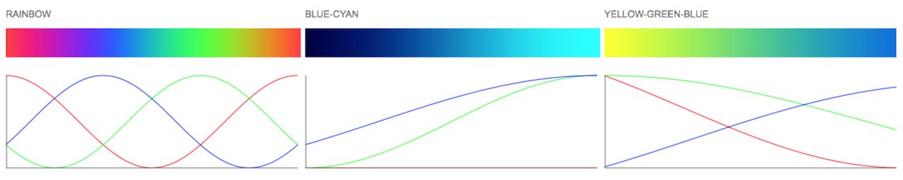

# cosine-gradient



[](http://github.com/badges/stability-badges)

Cosine gradient generator

## Usage

[](https://www.npmjs.com/package/cosine-gradient)


#### cosineGradient(schema)

returns function

#### hammersley(i, n)

Parameters:  
`schema` - array of cosine coefficients for R,G,B channels

Returns:  
`function(t)` - a function calculating a color value for t=0..1. The returned color is an array `[0..1, 0..1, 0..1]`


## Example

To get the middle blue gradient from the screenshot you would:

```javascript
var cosineGradient = require('cosine-gradient');
var schema = [
    [0.000,0.500,0.500],
    [0.000,0.500,0.500],
    [0.000,0.500,0.333],
    [0.000,0.500,0.667]
];
var gradient = cosineGradient(schema);

for(var i=0; i<=100; i++) {
    var t = i / 100;
    var color = gradient(t); //[R=0..1, G=0..1, B=0..1]
}
```

## Credits

This is an implementation of a technique by [Inigo Quilez](https://twitter.com/iquilezles) ([Color Palettes](http://www.iquilezles.org/www/articles/palettes/palettes.htm)) with color schemes by [Karsten Schmidt aka Toxi](http://twitter.com/toxi) from [thi.ng/color](https://github.com/thi-ng/color/blob/master/src/gradients.org) and [cosine gradient generator](http://dev.thi.ng/gradients/);

## License

MIT, see [LICENSE.md](http://github.com/vorg/cosine-gradient/blob/master/LICENSE.md) for details.
